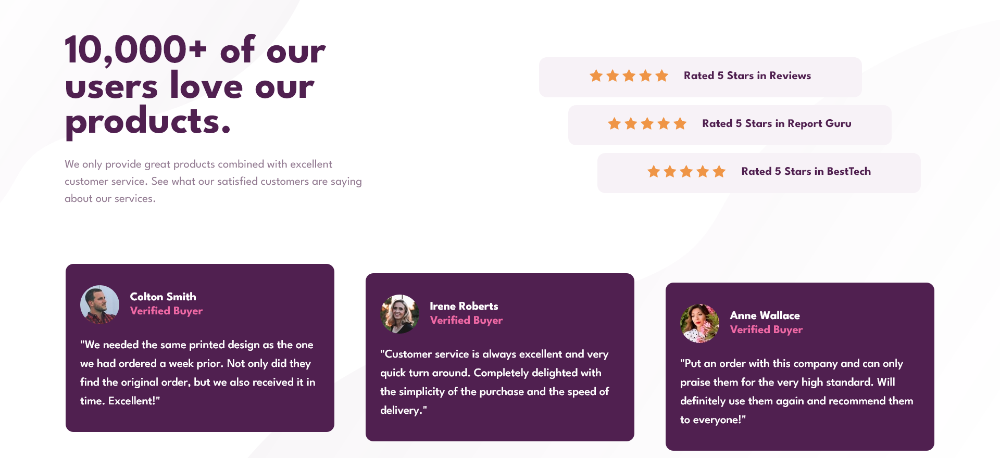

# Frontend Mentor - Social proof section solution

This is a solution to the [Social proof section challenge on Frontend Mentor](https://www.frontendmentor.io/challenges/social-proof-section-6e0qTv_bA). Frontend Mentor challenges help you improve your coding skills by building realistic projects. 

## Table of contents

- [Overview](#overview)
  - [The challenge](#the-challenge)
  - [Screenshot](#screenshot)
  - [Links](#links)
- [My process](#my-process)
  - [Built with](#built-with)
  - [What I learned](#what-i-learned)
  - [Continued development](#continued-development)
  - [Useful resources](#useful-resources)
- [Author](#author)

## Overview

### The challenge

Users should be able to:

- View the optimal layout for the section depending on their device's screen size

### Screenshot

### Links

- Solution URL: [Add solution URL here](https://your-solution-url.com)
- Live Site URL: [Add live site URL here](https://your-live-site-url.com)

## My process

### Built with

- Semantic HTML5 markup
- CSS custom properties
- Flexbox

### What I learned

- First of all, I tried to make the html more semantic. I used some tags I had never used before, such as <code>article</code>, <code>blockquote</code>, and <code>cite</code>. I think it can be useful while creating complicate website! So I will keep learning more about it and figure how to better the code and make it even more simpler. (Because I still ended up using serval <code>div</code>).

### Continued development

- The CSS code is a bit messy. I would like to make it simpler. 
- I will try to figure out how to make the bottom of the first review box stays higher than the second one while the second one is also higher than the third one.  

### Useful resources

- [px to rem converter](https://nekocalc.com/px-to-rem-converter) - I try to use rem instead of fixed size(px) in some parts of my code. By using this converter, I can easily turn the px in mind into the correct rem.
- [5 simple tips to making responsive layouts the easy way](https://www.youtube.com/watch?v=VQraviuwbzU) - This is an great video for beginners to learn some basic ideas about making a more repsonsive layout.

## Author

- Frontend Mentor - [@Yiwen Chen](https://www.frontendmentor.io/profile/CHEN-YiWen)
